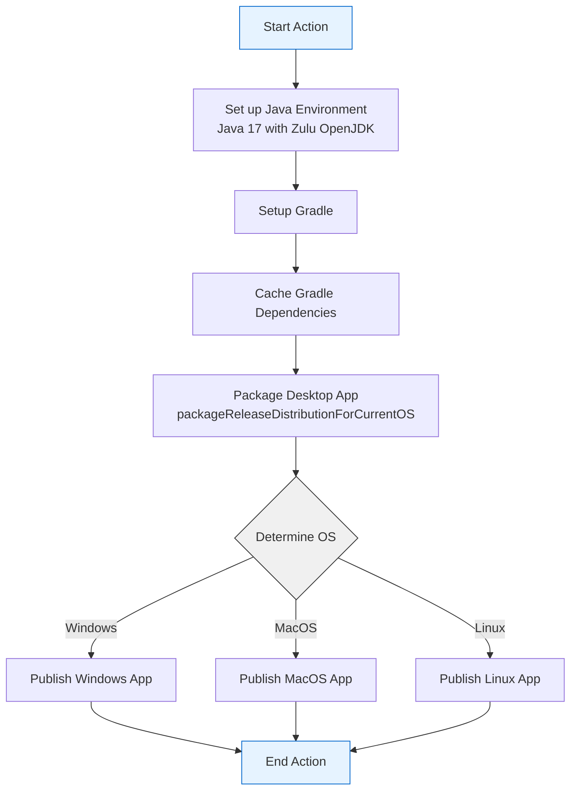

# KMP Publish Desktop App GitHub Action

## Overview

This GitHub Action automates the publishing process for desktop applications across multiple platforms (Windows, MacOS, Linux) using Kotlin Multiplatform.

## Workflow Visualization



## Inputs Configuration

| Input                         | Description                        | Required | Type   | Default |
|-------------------------------|------------------------------------|----------|--------|---------|
| `desktop_package_name`        | Name of the desktop project module | **Yes**  | String | -       |
| `windows_signing_key`         | Signing key for Windows app        | No       | String | -       |
| `windows_signing_password`    | Signing password for Windows app   | No       | String | -       |
| `windows_signing_certificate` | Signing certificate for Windows app | No       | String | -       |
| `macos_signing_key`           | Signing key for MacOS app          | No       | String | -       |
| `macos_signing_password`      | Signing password for MacOS app     | No       | String | -       |
| `macos_signing_certificate`   | Signing certificate for MacOS app  | No       | String | -       |
| `linux_signing_key`           | Signing key for Linux app          | No       | String | -       |
| `linux_signing_password`      | Signing password for Linux app     | No       | String | -       |
| `linux_signing_certificate`   | Signing certificate for Linux app  | No       | String | -       |
| `java-version`                | Java version to use   | No       | String | 17      |

## Action Workflow Steps

1. **Java Environment Setup**
  - Uses Zulu OpenJDK distribution
  - Configurable java version(default 17)

2. **Gradle Configuration**
  - Sets up Gradle build system
  - Configures caching for dependencies

3. **Dependency Caching**
  - Caches Gradle caches and wrapper
  - Speeds up subsequent builds
  - Reduces build time and network usage

4. **Desktop App Packaging**
  - Runs `packageReleaseDistributionForCurrentOS`
  - Builds app for current operating system

5. **Platform-Specific Publishing**
  - Conditional publishing based on runner OS
  - Separate steps for Windows, MacOS, and Linux

## Usage Example

```yaml
name: Publish Desktop App

on:
  release:
    types: [created]

jobs:
  publish-desktop-app:
    strategy:
      matrix:
        os: [ubuntu-latest, windows-latest, macos-latest]
    runs-on: ${{ matrix.os }}
    steps:
      - uses: actions/checkout@v4
      - uses: openMF/mifos-x-actionhub-publish-desktop-app@v1.0.1
        with:
          desktop_package_name: 'my-desktop-module'
          windows_signing_key: ${{ secrets.WINDOWS_SIGNING_KEY }}
          windows_signing_password: ${{ secrets.WINDOWS_SIGNING_PASSWORD }}
          windows_signing_certificate: ${{ secrets.WINDOWS_SIGNING_CERTIFICATE }}
          macos_signing_key: ${{ secrets.MACOS_SIGNING_KEY }}
          macos_signing_password: ${{ secrets.MACOS_SIGNING_PASSWORD }}
          macos_signing_certificate: ${{ secrets.MACOS_SIGNING_CERTIFICATE }}
          linux_signing_key: ${{ secrets.LINUX_SIGNING_KEY }}
          linux_signing_password: ${{ secrets.LINUX_SIGNING_PASSWORD }}
          linux_signing_certificate: ${{ secrets.LINUX_SIGNING_CERTIFICATE }}
          java-version: '21'
```

## Best Practices

- Provide signing credentials securely using GitHub Secrets
- Ensure consistent Java and Gradle versions
- Test publishing on all target platforms
- Verify signing configurations before release

## Troubleshooting

- Check Gradle logs for packaging issues
- Verify signing credential formats
- Ensure cross-platform compatibility of build scripts
- Validate OS-specific build requirements